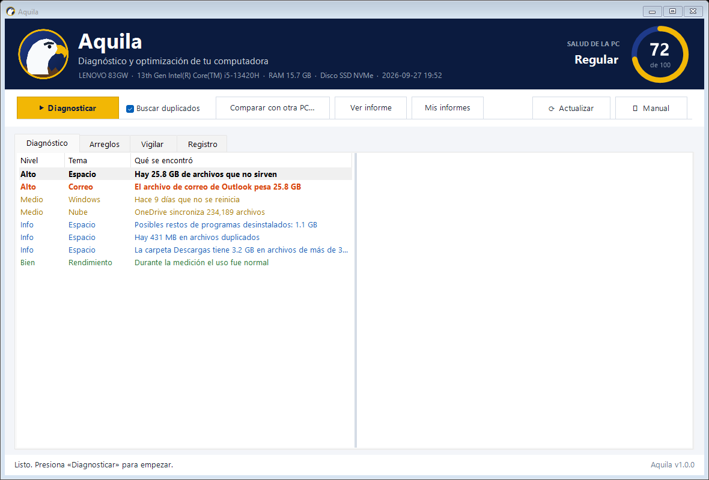

<p align="center">
  
</p>

<h1 align="center">Aquila</h1>
<p align="center"><b>Diagnóstico y optimización de computadoras y laptops con Windows</b><br>
Te dice en palabras simples por qué tu PC está lenta y la deja como cuando la compraste.</p>

---

## Instalar

Abre **PowerShell** (menú Inicio → escribe `PowerShell`) y pega:

```powershell
irm https://raw.githubusercontent.com/rtsebastian2-collab/aquila/main/instalar.ps1 | iex
```

En segundos aparece el icono del águila **Aquila** en el escritorio y se abre el manual.

**Funciona en:** Windows 10 y Windows 11 (PCs de escritorio y laptops). No necesita instalar nada más.

<p align="center"></p>

## Qué hace

| | |
|---|---|
| 🔍 **Diagnostica** | Procesador, RAM, tipo y salud del disco, programas al encender, tiempo de encendido, OneDrive/Google Drive/Dropbox, tamaño de Outlook, antivirus, configuración de Windows. |
| 🧠 **Explica** | Cada problema trae «¿por qué pasa?» y «qué hacer», en lenguaje simple, con un puntaje de salud de 0 a 100. |
| 🧹 **Libera espacio** | Papelera, temporales, Windows.old, cachés de navegadores y Teams, volcados de errores, puntos de restauración viejos, restos de programas y **archivos duplicados**. |
| ⚡ **Arregla** | Programas al encender, plan de energía, efectos visuales, correo de Outlook, reparación de Windows (DISM/SFC), TRIM/desfragmentado, análisis de virus. |
| 👁 **Vigila** | Mide cada 3 segundos y atrapa al programa culpable justo cuando la PC se pone lenta, con gráfico y ranking. |
| ⚖️ **Compara** | Pone dos PCs (o el antes y después) lado a lado. |

## Seguridad

- Antes de **cada** cambio muestra qué hace, por qué y si afecta algo, y pide confirmación.
- Crea un **punto de restauración** de Windows antes del primer cambio.
- Los duplicados van a la **Papelera** (recuperables).
- **Nunca** borra documentos personales ni archivos de correo PST.

## Actualizaciones

Aquila revisa este repositorio cada vez que se abre. Si hay una versión nueva, pregunta y se actualiza sola. También hay un botón **⟳ Actualizar**. Los informes (en `Documentos\Aquila\Informes`) se conservan.

## Desinstalar

Menú Inicio → **Aquila** → **Desinstalar Aquila**.

## Manual

El manual completo se abre al instalar y con el botón **Manual**: [app/Manual.html](app/Manual.html).

---

### Para quien mantiene el proyecto

```
app/                      Lo que se instala en %LOCALAPPDATA%\Aquila\app
  Aquila.ps1              Ventana principal (WinForms)
  Aquila-Diagnostico.ps1  Motor: mide, diagnostica, genera informe y aplica arreglos
  Aquila-Vigilar.ps1      Modo vigilancia
  Comun.ps1               Funciones, textos y estilos compartidos
  Desinstalar.ps1         Desinstalador
  Manual.html, aquila.ico, logo.png, aquila.svg
instalar.ps1              Instalador / actualizador (irm | iex)
version.txt               Versión publicada: subirla dispara la actualización en todas las PCs
herramientas/crear-icono.ps1  Genera el símbolo del águila (ico, png, svg)
```

**Publicar una actualización:** hacer los cambios, subir el número en `version.txt` (por ejemplo `1.0.1`) y hacer push a `main`. Cada PC con Aquila lo detecta al abrirla.
